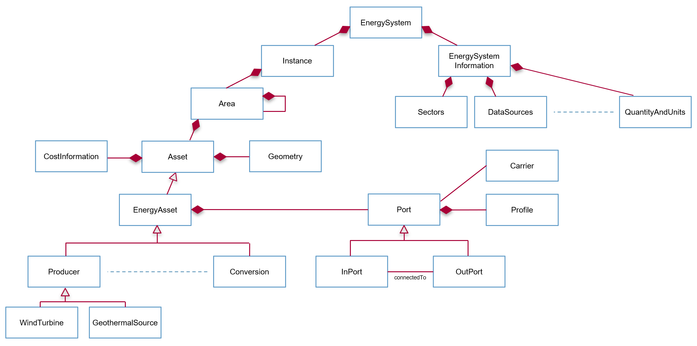

Introduction
============

pyESDL is a Python library for using ESDL in Python programs. It is created to support developers creating, parsing, generating ESDL files

This package contains:

- all generated Python classes for each ESDL object in the ESDL language
- an EnergySystemHandler that helps the developer to read and write ESDL files
- helper classes and functions to make it easier to deal with profiles, geometries, quantity and units, the Energy Data Repository (EDR)

Energy System Description Language (ESDL)
-----------------------------------------
The Energy System Description Language (ESDL) is a modelling language created for modelling the components in an energy system and their relations towards each other.

ESDL was developed with the goal to create interoperable energy system transition tooling in mind.

More information about ESDL can be found at:

- `ESDL gitbook documentation <https://energytransition.gitbook.io/esdl/>`_ with a general introduction, example applications and some code samples.
- `ESDL Model Reference documentation <https://energytransition.github.io/>`_ that describes all the classes and definitions in detail using a clickable UML diagram.
- `ESDL webiste <https://www.esdl.nl>`_ (in Dutch) with some high level descriptions and links to other places

High level structure of ESDL
----------------------------
The ESDL object model is an Object Oriented data model with the following high-level structure:

