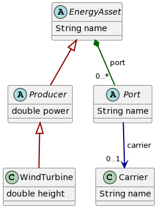

Technical foundation
====================

ESDL: Different than Excel and CSV for data
-------------------------------------------

Current data formats, such as Excel or CSV have their limits to document energy systems to their full extend:

- Expressing relations (e.g. connectivity information for infrastructure)
- Data types (date, time, daylight savings, integers, floats, strings)
- Units of measure (Watt, Joule, Eur, m/s, bar)
- Interoperability between tools trying to use same input, or use the output from one tool for the other.

ESDL addresses the issues mentioned above. It is based on `object-oriented <https://en.wikipedia.org/wiki/Object-oriented_programming>`_ principles and uses a subset of the `Unified Modelling Language <https://en.wikipedia.org/wiki/Unified_Modeling_Language>`_ (UML) to model
energy systems. This subset is called ECore and is part of the `Eclipse Modelling Framework <https://eclipse.dev/modeling/emf/>`_ and makes it easy to convert
convert models defined in ECore to (executable) code. Object-oriented means that everything is modelled as an
`object` with certain properties and that these objects have relations among each other with certain rules:

- Strict typing: every object has a type
- Objects contain data by defining attributes and references
  - Attributes are typed, even in Python. E.g :code:`name` (string), :code:`power` (double), :code:`height` (double)
  - Ability to refer to other objects using references, which creates the possibility to create graphs.
- Objects can contain other objects (containment relation), this creates a tree structure allowing for
  navigation within this structure (e.g. :code:`asset.port[0].carrier` means the carrier of the first port of this asset)

By using UML you can define strict rules for defining Energy Systems and consequently
data exchange and interoperability become far more easy. Furthermore data is machine-readable, which means
we can automate all kinds of transformation of the data with (python) scripts and other software, reducing the
manual effort that is usually needed to convert (raw) data to the right format.

UML is also a visual language: you can visualise the ESDL model using diagrams and a specific notation for arrows.
This makes it easier to communicate about ESDL and its properties.

The figure below shows an example class diagram. The full ESDL class diagram can be found
at `ESDL Model reference documentation <https://energytransition.github.io>`_

.. raw:: html

    

.. role:: red
.. role:: blue
.. role:: green

There are three different arrows/links used in this diagram:

1. :green:`Containment relation: object is part of parent object. The diamond arrow (green)`

     | The relation between ``EnergyAsset`` and ``Port`` is named ``port`` and may contain 0 or more ``Ports``

2. :red:`Inheritance: attributes of parent are inherited. The open arrow (red)`

    | ``WindTurbine`` is a subtype of ``Producer`` and inherits attributes from its (grand)parents, both ``Producer`` and ``EnergyAsset``.

    | So a ``WindTurbine`` has three attributes: name, power and height.

3. :blue:`References: pointers to other elements in the object tree. The closed arrow (blue).`

    | A ``Port`` has a reference to a ``Carrier`` named ``carrier``. This ``Carrier`` instance is defined somewhere else in the ESDL file (e.g. in ``EnergySystem - EnergySystemInformation - Carriers``)

    | References reduce data repetition: define once, reuse everywhere

Additionaly, arrows for containment and references can contain a multiplicity (see above) to define the amount
of (containment) relations (see figure above).

- 0..*  → List of Port  (read as zero or more)
- 0..1  → optional Carrier (read as zero or one)

Furthermore, some classes are `abstract` (contain data, but cannot be instantiated),
prefixed with an A in a circle and in italics. E.g. you cannot create an instance of the EnergyAsset class (nor Producer or Port) itself,
but you should always instantiate a subclass, in this case ``WindTurbine``.

An additional benefit of using ECore and strict typing is that all this information
about how classes relate to other classes in ESDL is also available at runtime. This benefit
is extensively used in tools like the ESDL Mapeditor to generate its user interface.

- E.g. when editing properties of an Asset, the GUI is fully automatically generated. When we change the ESDL structure (the ECore model)
  e.g. adding an attribute to a Producer, the user interface is automatically adapted to this new addition, without
  requiring developers to change things.
- The documentation site at https://energytransition.github.io is automatically generated based on the ESDL Ecore model. Therefore it is always up to date.
- The classes used in pyESDL (this package) are automatically generated based on the Ecore model of ESDL. Any changes in ESDL are automatically reflected in pyESDL.

